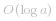
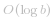

## 基本分析

前天复习了 [数学（求根公式）](https://leetcode-cn.com/problems/arranging-coins/solution/gong-shui-san-xie-yi-ti-shuang-jie-shu-x-sv9o/)，昨天复习了 [英语（数字单词）](https://leetcode-cn.com/problems/integer-to-english-words/solution/gong-shui-san-xie-zi-fu-chuan-da-mo-ni-b-0my6/)，今天考一下「语文（阅读理解）」🤣 。

主要的歧义在于第三点限制「假设我们的环境只能存储 *32* 位有符号整数，其数值范围是 *[−2^{31}, 2^{31} − 1]*。本题中，如果除法结果溢出，则返回 *2^{31} − 1*」的理解。

该限制有两种理解方式：

1. 不限制算法使用 `long`，只是解释为什么在溢出时，返回 *2^{31} − 1*；
2. 限制算法使用 `long`。

原始题解在 [这里](https://leetcode-cn.com/problems/divide-two-integers/solution/shua-chuan-lc-er-fen-bei-zeng-cheng-fa-j-m73b/) 。

---

## 理解一（不限制 `long`）

当不限制使用 `long` 时，基本思路为：

* 首先，`dividend` 和 `divisor` 均有「正数」和「负数」两种可能，当且仅当其中一者为负数时，结果为负，为了方便，我们可以先记录最终结果的正负号，然后将 `dividend` 和 `divisor` 都当成正数来处理；
* 现在两者都满足 *x >= 0*，然后利用 `dividend` 和 `divisor` 均为 `int`，可以确定答案的绝对值落在 *[0, dividend]* 范围内（当且仅当 `divisor` 是范围在 *[0, 1]* 的浮点数时，答案会大于 `dividend`）；
* 假设答案为 *x*，那么在以 *x* 为分割点的整数数轴上，具有「二段性」，因此我们可以二分找到该分割点：
    * 大于 *x* 的数 *y* 满足 *y * b > a*；
    * 小于等于 *x* 的数 *y* 不满足 *y * b > a*；
* 根据「二段性」分析，我们发现二分的 `check` 实现需要用到乘法，因此我们需要实现一个「不用乘法符号」的乘法实现（这可以使用倍增思想来实现 `mul` 操作）。

代码：
```Java []
class Solution {
    int INF = Integer.MAX_VALUE;
    public int divide(int _a, int _b) {
        long a = _a, b = _b;
        boolean flag = false;
        if ((a < 0 && b > 0) || (a > 0 && b < 0)) flag = true;
        if (a < 0) a = -a;
        if (b < 0) b = -b;
        long l = 0, r = a;
        while (l < r) {
            long mid = l + r + 1 >> 1;
            if (mul(mid, b) <= a) l = mid;
            else r = mid - 1;
        }
        r = flag ? -r : r;
        if (r > INF || r < -INF - 1) return INF;
        return (int)r;
    }
    long mul(long a, long k) {
        long ans = 0;
        while (k > 0) {
            if ((k & 1) == 1) ans += a;
            k >>= 1;
            a += a;
        }
        return ans;
    }
}
```
* 时间复杂度：在 *[0, a]* 范围内二分操作，复杂度为 ；倍增乘法的与操作数的二进制长度相关，复杂度为  。整体复杂度为  
* 空间复杂度：*O(1)*

---

## 理解二（限制 `long`）

对于全程不使用 `long` 的做法，我们需要将所有数映射到负数进行处理（以 *0* 为分割点，负数所能表示的范围更大）。

基本思路为：

* 起始先对边界情况进行特判；
* 记录最终结果的符号，并将两数都映射为负数；
* 可以预处理出倍增数组，或采取逐步增大 `dividend` 来逼近 `divisor` 的方式。

> 由于操作数都是负数，因此自倍增过程中，如果操作数小于 `INT_MIN` 的一半（`-1073741824`），则代表发生溢出。

代码：
```Java []
class Solution {
    int MIN = Integer.MIN_VALUE, MAX = Integer.MAX_VALUE;
    int LIMIT = -1073741824; // MIN 的一半
    public int divide(int a, int b) {
        if (a == MIN && b == -1) return MAX;
        boolean flag = false;
        if ((a > 0 && b < 0) || (a < 0 && b > 0)) flag = true;
        if (a > 0) a = -a;
        if (b > 0) b = -b;
        int ans = 0;
        while (a <= b){
            int c = b, d = -1;
            while (c >= LIMIT && d >= LIMIT && c >= a - c){
                c += c; d += d;
            }
            a -= c;
            ans += d;
        }
        return flag ? ans : -ans;
    }
}
```
* 时间复杂度： 
* 空间复杂度：*O(1)*

---

## 最后

**如果有帮助到你，请给题解点个赞和收藏，让更多的人看到 ~ ("▔□▔)/**

也欢迎你 [关注我](https://oscimg.oschina.net/oscnet/up-19688dc1af05cf8bdea43b2a863038ab9e5.png)（公主号后台回复「送书」即可参与长期看题解学算法送实体书活动）或 加入[「组队打卡」](https://leetcode-cn.com/u/ac_oier/)小群 ，提供写「证明」&「思路」的高质量题解。

所有题解已经加入 [刷题指南](https://github.com/SharingSource/LogicStack-LeetCode/wiki)，欢迎 star 哦 ~ 