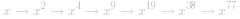
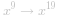

### 📺视频题解


### 📖文字题解

#### 前言

本题的方法被称为「快速幂算法」，有递归和迭代两个版本。这篇题解会从递归版本的开始讲起，再逐步引出迭代的版本。

当指数 *n* 为负数时，我们可以计算 *x^{-n}* 再取倒数得到结果，因此我们只需要考虑 *n* 为自然数的情况。

#### 方法一：快速幂 + 递归

「快速幂算法」的本质是分治算法。举个例子，如果我们要计算 *x^{64}*，我们可以按照：

 

的顺序，从 *x* 开始，每次直接把上一次的结果进行平方，计算 *6* 次就可以得到 *x^{64}* 的值，而不需要对 *x* 乘 *63* 次 *x*。

再举一个例子，如果我们要计算 *x^{77}*，我们可以按照：

 

的顺序，在  ， ，  这些步骤中，我们直接把上一次的结果进行平方，而在  ， ，  这些步骤中，我们把上一次的结果进行平方后，还要额外乘一个 *x*。

直接从左到右进行推导看上去很困难，因为在每一步中，我们不知道在将上一次的结果平方之后，还需不需要额外乘 *x*。但如果我们从右往左看，分治的思想就十分明显了：

- 当我们要计算 *x^n* 时，我们可以先递归地计算出  ，其中   表示对 *a* 进行下取整；

- 根据递归计算的结果，如果 *n* 为偶数，那么 *x^n = y^2*；如果 *n* 为奇数，那么  ；

- 递归的边界为 *n = 0*，任意数的 *0* 次方均为 *1*。

由于每次递归都会使得指数减少一半，因此递归的层数为  ，算法可以在很快的时间内得到结果。

```C++ [sol1-C++]
class Solution {
public:
    double quickMul(double x, long long N) {
        if (N == 0) {
            return 1.0;
        }
        double y = quickMul(x, N / 2);
        return N % 2 == 0 ? y * y : y * y * x;
    }

    double myPow(double x, int n) {
        long long N = n;
        return N >= 0 ? quickMul(x, N) : 1.0 / quickMul(x, -N);
    }
};
```

```Java [sol1-Java]
class Solution {
    public double myPow(double x, int n) {
        long N = n;
        return N >= 0 ? quickMul(x, N) : 1.0 / quickMul(x, -N);
    }

    public double quickMul(double x, long N) {
        if (N == 0) {
            return 1.0;
        }
        double y = quickMul(x, N / 2);
        return N % 2 == 0 ? y * y : y * y * x;
    }
}
```

```Python [sol1-Python3]
class Solution:
    def myPow(self, x: float, n: int) -> float:
        def quickMul(N):
            if N == 0:
                return 1.0
            y = quickMul(N // 2)
            return y * y if N % 2 == 0 else y * y * x
        
        return quickMul(n) if n >= 0 else 1.0 / quickMul(-n)
```

```golang [sol1-Golang]
func myPow(x float64, n int) float64 {
    if n >= 0 {
        return quickMul(x, n)
    }
    return 1.0 / quickMul(x, -n)
}

func quickMul(x float64, n int) float64 {
    if n == 0 {
        return 1
    }
    y := quickMul(x, n/2)
    if n%2 == 0 {
        return y * y
    }
    return y * y * x
}
```

**复杂度分析**

- 时间复杂度： ，即为递归的层数。

- 空间复杂度： ，即为递归的层数。这是由于递归的函数调用会使用栈空间。

#### 方法二：快速幂 + 迭代

由于递归需要使用额外的栈空间，我们试着将递归转写为迭代。在方法一中，我们也提到过，从左到右进行推导是不容易的，因为我们不知道是否需要额外乘 *x*。但我们不妨找一找规律，看看哪些地方额外乘了 *x*，并且它们对答案产生了什么影响。

我们还是以 *x^{77}* 作为例子：

 

并且把需要额外乘 *x* 的步骤打上了 *+* 标记。可以发现：

-   中额外乘的 *x* 在 *x^{77}* 中贡献了 *x*；

-   中额外乘的 *x* 在之后被平方了 *2* 次，因此在 *x^{77}* 中贡献了 *x^{2^2} = x^4*；

-   中额外乘的 *x* 在之后被平方了 *3* 次，因此在 *x^{77}* 中贡献了 *x^{2^3} = x^8*；

- 最初的 *x* 在之后被平方了 *6* 次，因此在 *x^{77}* 中贡献了 *x^{2^6} = x^{64}*。

我们把这些贡献相乘，  恰好等于 *x^{77}*。而这些贡献的指数部分又是什么呢？它们都是 *2* 的幂次，这是因为每个额外乘的 *x* 在之后都会被平方若干次。而这些指数 *1*，*4*，*8* 和 *64*，**恰好就对应了 *77* 的二进制表示 *(1001101)_2* 中的每个 *1***！

因此我们借助整数的二进制拆分，就可以得到迭代计算的方法，一般地，如果整数 *n* 的二进制拆分为

 

那么

 

这样以来，我们从 *x* 开始不断地进行平方，得到  ，如果 *n* 的第 *k* 个（从右往左，从 *0* 开始计数）二进制位为 *1*，那么我们就将对应的贡献 *x^{2^k}*计入答案。

下面的代码给出了详细的注释。

```C++ [sol2-C++]
class Solution {
public:
    double quickMul(double x, long long N) {
        double ans = 1.0;
        // 贡献的初始值为 x
        double x_contribute = x;
        // 在对 N 进行二进制拆分的同时计算答案
        while (N > 0) {
            if (N % 2 == 1) {
                // 如果 N 二进制表示的最低位为 1，那么需要计入贡献
                ans *= x_contribute;
            }
            // 将贡献不断地平方
            x_contribute *= x_contribute;
            // 舍弃 N 二进制表示的最低位，这样我们每次只要判断最低位即可
            N /= 2;
        }
        return ans;
    }

    double myPow(double x, int n) {
        long long N = n;
        return N >= 0 ? quickMul(x, N) : 1.0 / quickMul(x, -N);
    }
};
```

```Java [sol2-Java]
class Solution {
    public double myPow(double x, int n) {
        long N = n;
        return N >= 0 ? quickMul(x, N) : 1.0 / quickMul(x, -N);
    }

    public double quickMul(double x, long N) {
        double ans = 1.0;
        // 贡献的初始值为 x
        double x_contribute = x;
        // 在对 N 进行二进制拆分的同时计算答案
        while (N > 0) {
            if (N % 2 == 1) {
                // 如果 N 二进制表示的最低位为 1，那么需要计入贡献
                ans *= x_contribute;
            }
            // 将贡献不断地平方
            x_contribute *= x_contribute;
            // 舍弃 N 二进制表示的最低位，这样我们每次只要判断最低位即可
            N /= 2;
        }
        return ans;
    }
}
```

```Python [sol2-Python3]
class Solution:
    def myPow(self, x: float, n: int) -> float:
        def quickMul(N):
            ans = 1.0
            # 贡献的初始值为 x
            x_contribute = x
            # 在对 N 进行二进制拆分的同时计算答案
            while N > 0:
                if N % 2 == 1:
                    # 如果 N 二进制表示的最低位为 1，那么需要计入贡献
                    ans *= x_contribute
                # 将贡献不断地平方
                x_contribute *= x_contribute
                # 舍弃 N 二进制表示的最低位，这样我们每次只要判断最低位即可
                N //= 2
            return ans
        
        return quickMul(n) if n >= 0 else 1.0 / quickMul(-n)
```

```golang [sol2-Golang]
func myPow(x float64, n int) float64 {
    if n >= 0 {
        return quickMul(x, n)
    }
    return 1.0 / quickMul(x, -n)
}

func quickMul(x float64, N int) float64 {
    ans := 1.0
    // 贡献的初始值为 x
    x_contribute := x
    // 在对 N 进行二进制拆分的同时计算答案
    for N > 0 {
        if N % 2 == 1 {
            // 如果 N 二进制表示的最低位为 1，那么需要计入贡献
            ans *= x_contribute
        }
        // 将贡献不断地平方
        x_contribute *= x_contribute
        // 舍弃 N 二进制表示的最低位，这样我们每次只要判断最低位即可
        N /= 2
    }
    return ans
}
```

**复杂度分析**

- 时间复杂度： ，即为对 *n* 进行二进制拆分的时间复杂度。

- 空间复杂度：*O(1)*。