#### 前言

本题是经典的字符串单模匹配的模型，因此可以使用字符串匹配算法解决，常见的字符串匹配算法包括暴力匹配、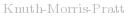  算法、  算法、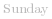  算法等，本文将讲解   算法。

因为哈希方法可能出现哈希值相等但是字符串不相等的情况，而 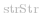  函数要求匹配结果必定正确，因此本文不介绍哈希方法，有兴趣的读者可以自行了解滚动哈希的实现（如   算法）。

#### 方法一：暴力匹配

**思路及算法**

我们可以让字符串 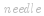  与字符串 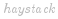  的所有长度为 *m* 的子串均匹配一次。

为了减少不必要的匹配，我们每次匹配失败即立刻停止当前子串的匹配，对下一个子串继续匹配。如果当前子串匹配成功，我们返回当前子串的开始位置即可。如果所有子串都匹配失败，则返回 *-1*。

**代码**

```C++ [sol1-C++]
class Solution {
public:
    int strStr(string haystack, string needle) {
        int n = haystack.size(), m = needle.size();
        for (int i = 0; i + m <= n; i++) {
            bool flag = true;
            for (int j = 0; j < m; j++) {
                if (haystack[i + j] != needle[j]) {
                    flag = false;
                    break;
                }
            }
            if (flag) {
                return i;
            }
        }
        return -1;
    }
};
```

```Java [sol1-Java]
class Solution {
    public int strStr(String haystack, String needle) {
        int n = haystack.length(), m = needle.length();
        for (int i = 0; i + m <= n; i++) {
            boolean flag = true;
            for (int j = 0; j < m; j++) {
                if (haystack.charAt(i + j) != needle.charAt(j)) {
                    flag = false;
                    break;
                }
            }
            if (flag) {
                return i;
            }
        }
        return -1;
    }
}
```

```JavaScript [sol1-JavaScript]
var strStr = function(haystack, needle) {
    const n = haystack.length, m = needle.length;
    for (let i = 0; i + m <= n; i++) {
        let flag = true;
        for (let j = 0; j < m; j++) {
            if (haystack[i + j] != needle[j]) {
                flag = false;
                break;
            }
        }
        if (flag) {
            return i;
        }
    }
    return -1;
};
```

```go [sol1-Golang]
func strStr(haystack, needle string) int {
    n, m := len(haystack), len(needle)
outer:
    for i := 0; i+m <= n; i++ {
        for j := range needle {
            if haystack[i+j] != needle[j] {
                continue outer
            }
        }
        return i
    }
    return -1
}
```

```C [sol1-C]
int strStr(char* haystack, char* needle) {
    int n = strlen(haystack), m = strlen(needle);
    for (int i = 0; i + m <= n; i++) {
        bool flag = true;
        for (int j = 0; j < m; j++) {
            if (haystack[i + j] != needle[j]) {
                flag = false;
                break;
            }
        }
        if (flag) {
            return i;
        }
    }
    return -1;
}
```

**复杂度分析**

- 时间复杂度：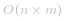 ，其中 *n* 是字符串   的长度，*m* 是字符串   的长度。最坏情况下我们需要将字符串   与字符串   的所有长度为 *m* 的子串均匹配一次。

- 空间复杂度：*O(1)*。我们只需要常数的空间保存若干变量。

#### 方法二：  算法

**思路及算法**

  算法，简称   算法，由  、  和 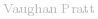  三人于 *1977* 年联合发表。

  算法的核心为前缀函数，记作 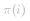 ，其定义如下：

对于长度为 *m* 的字符串 *s*，其前缀函数 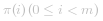  表示 *s* 的子串 *s[0:i]* 的最长的相等的真前缀与真后缀的长度。特别地，如果不存在符合条件的前后缀，那么 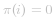 。其中真前缀与真后缀的定义为不等于自身的的前缀与后缀。

我们举个例子说明：字符串 *aabaaab* 的前缀函数值依次为 *0,1,0,1,2,2,3*。

- 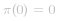 ，因为 *a* 没有真前缀和真后缀，根据规定为 *0*（可以发现对于任意字符串   必定成立）；

- 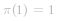 ，因为 *aa* 最长的一对相等的真前后缀为 *a*，长度为 *1*；

- 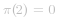 ，因为 *aab* 没有对应真前缀和真后缀，根据规定为 *0*；

- 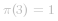 ，因为 *aaba* 最长的一对相等的真前后缀为 *a*，长度为 *1*；

- 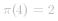 ，因为 *aabaa* 最长的一对相等的真前后缀为 *aa*，长度为 *2*；

- 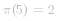 ，因为 *aabaaa* 最长的一对相等的真前后缀为 *aa*，长度为 *2*；

- 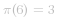 ，因为 *aabaaab* 最长的一对相等的真前后缀为 *aab*，长度为 *3*。

有了前缀函数，我们就可以快速地计算出模式串在主串中的每一次出现。

**如何求解前缀函数**

长度为 *m* 的字符串 *s* 的所有前缀函数的求解算法的总时间复杂度是严格 *O(m)* 的，且该求解算法是增量算法，即我们可以一边读入字符串，一边求解当前读入位的前缀函数。

为了叙述方便，我们接下来将说明几个前缀函数的性质：

1. 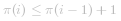 。
   - 依据   定义得：![s\[0:\pi(i)-1\]=s\[i-\pi(i)+1:i\] ](./p__s_0:pi_i_-1_=s_i-pi_i_+1:i__.png) 。
   - 将两区间的右端点同时左移，可得：![s\[0:\pi(i)-2\]=s\[i-\pi(i)+1:i-1\] ](./p__s_0:pi_i_-2__=_s_i-pi_i_+1:i-1__.png) 。
   - 依据 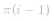  定义得：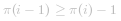 ，即  。
2. 如果 ![s\[i\]=s\[\pi(i-1)\] ](./p__s_i_=s_pi_i-1___.png) ，那么 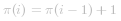 。
   - 依据   定义得：![s\[0:\pi(i-1)-1\]=s\[i-\pi(i-1):i-1\] ](./p__s_0:pi_i-1_-1_=s_i-pi_i-1_:i-1__.png) 。
   - 因为 ![s\[\pi(i-1)\]=s\[i\] ](./p__s_pi_i-1__=s_i__.png) ，可得 ![s\[0:\pi(i-1)\]=s\[i-\pi(i-1):i\] ](./p__s_0:pi_i-1__=s_i-pi_i-1_:i__.png) 。
   - 依据   定义得：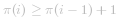 ，结合第一个性质可得  。

这样我们可以依据这两个性质提出求解   的方案：找到最大的 *j*，满足 *s[0:j-1]=s[i-j:i-1]*，且 *s[i]=s[j]*（这样就有 *s[0:j]=s[i-j:i]*，即 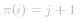 ）。

注意这里提出了两个要求：

1. *j* 要求尽可能大，且满足 *s[0:j-1]=s[i-j:i-1]*；
2. *j* 要求满足 *s[i]=s[j]*。

由   定义可知：

![s\[0:\pi(i-1)-1\]=s\[i-\pi(i-1):i-1\]\tag{1} ](./p___s_0:pi_i-1_-1_=s_i-pi_i-1_:i-1__tag{1}__.png) 

那么 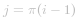  符合第一个要求。如果 ![s\[i\]=s\[\pi(i-1)\] ](./p__s_i_=s_pi_i-1___.png) ，我们就可以确定  。

否则如果 ![s\[i\]\neqs\[\pi(i-1)\] ](./p__s_i_neq_s_pi_i-1___.png) ，那么 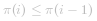 ，因为 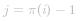 ，所以 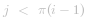 ，于是可以取 *(1)* 式两子串的长度为 *j* 的后缀，它们依然是相等的：![s\[\pi(i-1)-j:\pi(i-1)-1\]=s\[i-j:i-1\] ](./p__s_pi_i-1_-j:pi_i-1_-1_=s_i-j:i-1__.png) 。

当 ![s\[i\]\neqs\[\pi(i-1)\] ](./p__s_i_neq_s_pi_i-1___.png)  时，我们可以修改我们的方案为：找到最大的 *j*，满足 ![s\[0:j-1\]=s\[\pi(i-1)-j:\pi(i-1)-1\] ](./p__s_0:j-1_=s_pi_i-1_-j:pi_i-1_-1__.png) ，且 ![s\[i\]=s\[\pi(i-1)\] ](./p__s_i_=s_pi_i-1___.png) （这样就有 ![s\[0:j\]=s\[\pi(i-1)-j:\pi(i-1)\] ](./p__s_0:j_=s_pi_i-1_-j:pi_i-1___.png) ，即  ）。

注意这里提出了两个要求：

1. *j* 要求尽可能大，且满足 ![s\[0:j-1\]=s\[\pi(i-1)-j:\pi(i-1)-1\] ](./p__s_0:j-1_=s_pi_i-1_-j:pi_i-1_-1__.png) ；
2. *j* 要求满足 *s[i]=s[j]*。

由 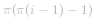  定义可知 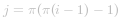  符合第一个要求。如果 ![s\[i\]=s\[\pi(\pi(i-1)-1)\] ](./p__s_i_=s_pi_pi_i-1_-1___.png) ，我们就可以确定  。

此时，我们可以发现 *j* 的取值总是被描述为 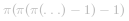  的结构（初始为  ）。于是我们可以描述我们的算法：设定  ，*j* 的初始值为  。我们只需要不断迭代 *j*（令 *j* 变为 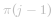 ）直到 *s[i]=s[j]* 或 *j=0* 即可，如果最终匹配成功（找到了 *j* 使得 *s[i]=s[j]*），那么  ，否则  。

**复杂度证明**

时间复杂度部分，注意到  ，即每次当前位的前缀函数至多比前一位增加一，每当我们迭代一次，当前位的前缀函数的最大值都会减少。可以发现前缀函数的总减少次数不会超过总增加次数，而总增加次数不会超过 *m* 次，因此总减少次数也不会超过 *m* 次，即总迭代次数不会超过 *m* 次。

空间复杂度部分，我们只用到了长度为 *m* 的数组保存前缀函数，以及使用了常数的空间保存了若干变量。

**如何解决本题**

记字符串   的长度为 *n*，字符串   的长度为 *m*。

我们记字符串  ，即将字符串   和   进行拼接，并用不存在于两串中的特殊字符   将两串隔开，然后我们对字符串   求前缀函数。

因为特殊字符   的存在，字符串   中   部分的前缀函数所对应的真前缀必定落在字符串   部分，真后缀必定落在字符串   部分。当   部分的前缀函数值为 *m* 时，我们就找到了一次字符串   在字符串   中的出现（因为此时真前缀恰为字符串  ）。

实现时，我们可以进行一定的优化，包括：

1. 我们无需显式地创建字符串  。
   - 为了节约空间，我们只需要顺次遍历字符串  、特殊字符   和字符串   即可。
2. 也无需显式地保存所有前缀函数的结果，而只需要保存字符串   部分的前缀函数即可。
   - 特殊字符   的前缀函数必定为 *0*，且易知 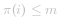 （真前缀不可能包含特殊字符  ）。
   - 这样我们计算   时，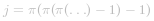  的所有的取值中仅有   的下标可能大于等于 *m*。我们只需要保存前一个位置的前缀函数，其它的 *j* 的取值将全部为字符串   部分的前缀函数。
3. 我们也无需特别处理特殊字符  ，只需要注意处理字符串   的第一个位置对应的前缀函数时，直接设定 *j* 的初值为 *0* 即可。

这样我们可以将代码实现分为两部分：

1. 第一部分是求   部分的前缀函数，我们需要保留这部分的前缀函数值。
2. 第二部分是求   部分的前缀函数，我们无需保留这部分的前缀函数值，只需要用一个变量记录上一个位置的前缀函数值即可。当某个位置的前缀函数值等于 *m* 时，说明我们就找到了一次字符串   在字符串   中的出现（因为此时真前缀恰为字符串  ，真后缀为以当前位置为结束位置的字符串   的子串），我们计算出起始位置，将其返回即可。

**代码**

```C++ [sol2-C++]
class Solution {
public:
    int strStr(string haystack, string needle) {
        int n = haystack.size(), m = needle.size();
        if (m == 0) {
            return 0;
        }
        vector<int> pi(m);
        for (int i = 1, j = 0; i < m; i++) {
            while (j > 0 && needle[i] != needle[j]) {
                j = pi[j - 1];
            }
            if (needle[i] == needle[j]) {
                j++;
            }
            pi[i] = j;
        }
        for (int i = 0, j = 0; i < n; i++) {
            while (j > 0 && haystack[i] != needle[j]) {
                j = pi[j - 1];
            }
            if (haystack[i] == needle[j]) {
                j++;
            }
            if (j == m) {
                return i - m + 1;
            }
        }
        return -1;
    }
};
```

```Java [sol2-Java]
class Solution {
    public int strStr(String haystack, String needle) {
        int n = haystack.length(), m = needle.length();
        if (m == 0) {
            return 0;
        }
        int[] pi = new int[m];
        for (int i = 1, j = 0; i < m; i++) {
            while (j > 0 && needle.charAt(i) != needle.charAt(j)) {
                j = pi[j - 1];
            }
            if (needle.charAt(i) == needle.charAt(j)) {
                j++;
            }
            pi[i] = j;
        }
        for (int i = 0, j = 0; i < n; i++) {
            while (j > 0 && haystack.charAt(i) != needle.charAt(j)) {
                j = pi[j - 1];
            }
            if (haystack.charAt(i) == needle.charAt(j)) {
                j++;
            }
            if (j == m) {
                return i - m + 1;
            }
        }
        return -1;
    }
}
```

```JavaScript [sol2-JavaScript]
var strStr = function(haystack, needle) {
    const n = haystack.length, m = needle.length;
    if (m === 0) {
        return 0;
    }
    const pi = new Array(m).fill(0);
    for (let i = 1, j = 0; i < m; i++) {
        while (j > 0 && needle[i] !== needle[j]) {
            j = pi[j - 1];
        }
        if (needle[i] == needle[j]) {
            j++;
        }
        pi[i] = j;
    }
    for (let i = 0, j = 0; i < n; i++) {
        while (j > 0 && haystack[i] != needle[j]) {
            j = pi[j - 1];
        }
        if (haystack[i] == needle[j]) {
            j++;
        }
        if (j === m) {
            return i - m + 1;
        }
    }
    return -1;
};
```

```go [sol2-Golang]
func strStr(haystack, needle string) int {
    n, m := len(haystack), len(needle)
    if m == 0 {
        return 0
    }
    pi := make([]int, m)
    for i, j := 1, 0; i < m; i++ {
        for j > 0 && needle[i] != needle[j] {
            j = pi[j-1]
        }
        if needle[i] == needle[j] {
            j++
        }
        pi[i] = j
    }
    for i, j := 0, 0; i < n; i++ {
        for j > 0 && haystack[i] != needle[j] {
            j = pi[j-1]
        }
        if haystack[i] == needle[j] {
            j++
        }
        if j == m {
            return i - m + 1
        }
    }
    return -1
}
```

```C [sol2-C]
int strStr(char* haystack, char* needle) {
    int n = strlen(haystack), m = strlen(needle);
    if (m == 0) {
        return 0;
    }
    int pi[m];
    pi[0] = 0;
    for (int i = 1, j = 0; i < m; i++) {
        while (j > 0 && needle[i] != needle[j]) {
            j = pi[j - 1];
        }
        if (needle[i] == needle[j]) {
            j++;
        }
        pi[i] = j;
    }
    for (int i = 0, j = 0; i < n; i++) {
        while (j > 0 && haystack[i] != needle[j]) {
            j = pi[j - 1];
        }
        if (haystack[i] == needle[j]) {
            j++;
        }
        if (j == m) {
            return i - m + 1;
        }
    }
    return -1;
}
```

**复杂度分析**

- 时间复杂度：*O(n+m)*，其中 *n* 是字符串   的长度，*m* 是字符串   的长度。我们至多需要遍历两字符串一次。

- 空间复杂度：*O(m)*，其中 *m* 是字符串   的长度。我们只需要保存字符串   的前缀函数。